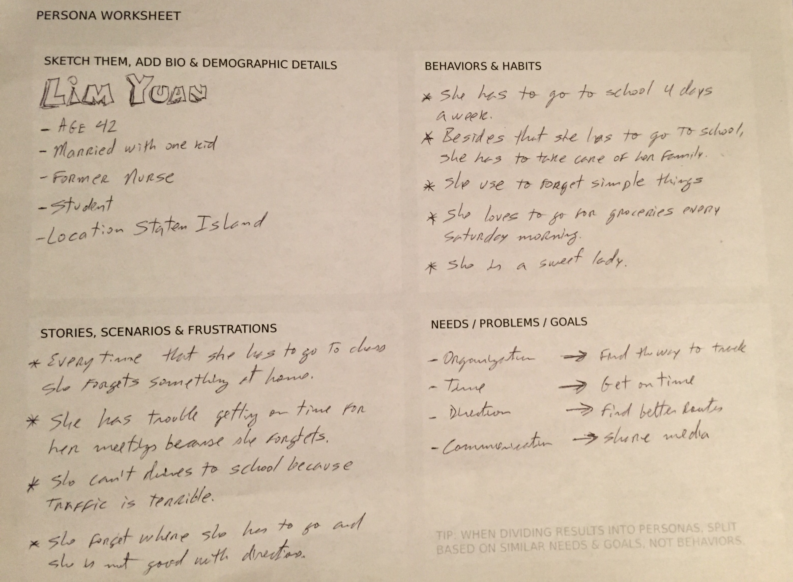
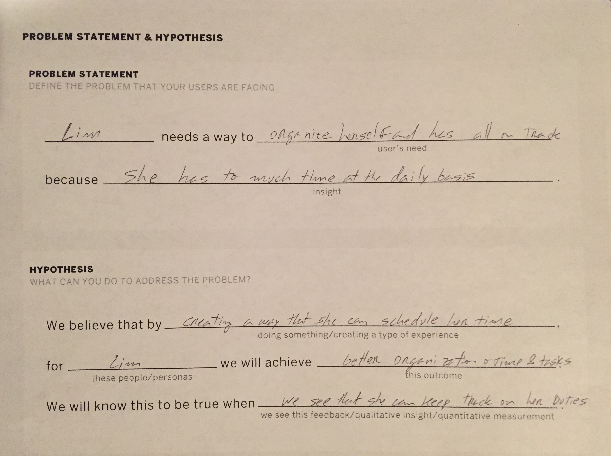

##Project 4
#Research Plan Worksheet 
##Project 4 "App Name"
###General Assembly student's interview

##Author
###Israel Manzo
<israelmanzo814@gmail.com>

Date: January 30, 2017

- This idea of solution of a issue become when a group of our class meet for an exercise of "Daily User situations to be resolve in an application". Part of outcomes that will help us to figure normal situaions. 

- Interviewing with a couple of my classmates I find out an organization issue on how to get to places and keep on track the solutions and list of ideas that could help. From this came the idea of a to do list friendly app, in addtion with some more features to get the app more helpful for the user experience.

##Research questions
The are questions that need to be asnwered at the end of this project.

* How this app help to resolve the user organization?

* What tool thsi app have to make the user interface easier?
* What this app implement to be different that the other?
* Is this app can be used when is not wifi?

* What can be changed to make this app better?

##Methodology
From now on we will working on create the interface of this app easy for the user experience. For the next week features will be developed and added.

##Target
* The first user is a busy person, mother, wife and same time student witha busy schedule she is trying to get organized and follow up onher duties.

* The second user is a student, young guy, single and only going to school.., but he need to keep on track his homework and assigments during the day and also he has campuses in different directions and he needs to get to both of them.

#####Results will be updated when the app is avaliable to use.

##List of topics as audience
* How to organize myself

* List of my duties

* Acces to directions easily without leave the app.

* Take notes during the use of the app

* Sharing my notes with friends or social media

#####How can I organize myself having a list of duties to do and check them out or delete them after are done? 

___________
-----------

##Persona

##Search highlights

##User stories
####Lim Yuan
* Mother

* Wife

* Student

Lim is a busy person that need a better way to orgainze her duties as mother and as student. She has to conmute everyday to school. To get there she needs to drive to the near train station and take the train to the city based that in the city is very crowded with vehicles and traffic.

We will support Lim witha an application that help her to organize her duties also to get directed in shorter time where she has to be and how.

####Matt Lucas
* Student

* Working part time

Matt is a young student that is almost ready to graduate from college and he has a part time job in the city. 

Matt need to travel from campuses to get into different class topics. After class he have to go to work in customer services. This will give him some cash to pay rent and food but he needs a way how he can keep on track what he has to do in daily basis with school and work. Also he needs to get to places but he is not to familiar with the city or with directions.

--------------
--------------

##Competitive analysis screenshot
TODO

##Problem statement worksheet

##Priorities features
* To do list

* Check out lists

* Delete or edit a task

* Location of place where task will be done

* Sharing options

* Search for lists

* List of priorities

##Wireframe Screenshot
TODO

